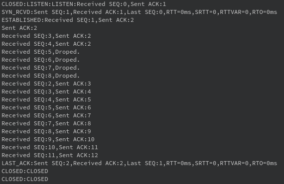

# jrReliableUDP  
参考TCP协议，基于UDP实现的应用层可靠传输协议，传送的是包而非字节流；目的是学习TCP协议工作机制。该传输协议实现了如下功能：  
1. 重传机制，包括超时重传和快速重传；  
2. 流量控制，采用滑动窗口和窗口通告机制实现； 
3. 拥塞控制，包括慢启动、拥塞避免和快速恢复。    

## 0 报文结构
### 0.1 TCP报文

### 0.2 本应用层协议报文
本协议基于UDP实现，而UDP中已包含源端口号、目的端口号以及校验和，因此在本协议的报文中并无上述字段；其次也没有首部长度字段、6位保留标志、URG标志、PSH标志、紧急指针字段和选项字段（因为用不着），报文具体结构如下图所示： 
  
注：TCP以及本协议中发送RST报文（重置报文）的时机   
1. 连接到达本地，但目的端口无进程监听；  
2. 终止连接，RST接收端将抛弃所有缓存数据并立即释放连接；  
3. 对端主机崩溃后重启，本端向对端照常发送报文，对端收到报文后将返回RST报文给本端。  
## 1 建立连接与断开连接  
### 1.1 建立连接——三次握手
  
1. 在代码实现中，为了方便所以把中间的SYN和ACK分开发送的：S端先回复ACK再发送SYN。  
2. 在套接字设计中，S端调用Socket::listen后S端连接被动打开，套接字进入监听（LISTEN）状态（即成为监听套接字），调用Socket::accept后将返回一个已进入ESTABLISHED状态的新套接字（即连接套接字），其用于与C端通讯；**监听套接字与连接套接字的关系是：连接套接字内部的系统套接字文件描述符由监听套接字内部系统套接字的文件描述符复制而来（在本协议中是调用::dup进行复制，但实际的TCP实现应该不是简单复制，应该还会进行其他操作），并非是新创建了一个系统套接字（若新创建一个系统套接字，那么新端口不可和监听套接字一致，将导致防火墙拦截新端口的通信或在大量连接到来后导致端口耗尽）**。
### 1.2 断开连接  ——四次挥手

## 2 重传机制
### 2.1 超时重传
  
RTT(Round-Trip Time):发送一个数据包后再收到ACK所经过的时间；  
RTO(Retransmission Timeout):超时重传时间。  
在代码实现中，RTT由ACK报文中携带的时间戳和接收到ACK报文时的时间戳确定，RTO的估计公式取自RFC6298。  
### 2.2 快速重传
  
在代码实现中，当发生快速重传时，发送窗口将回退到丢失的包处，重新发送该包后的所有包。
## 3 流量控制
**流量控制是为了匹配接受与发送速度，防止因为过快的发送速度导致接收端被迅速填满而后失去响应。**
### 3.1 发送窗口
下图取自《TCP/IP详解 卷1：协议》，SND.WND由报文中的窗口通告确定。  
  
发送窗口实现采用std::map容器，根据报文SEQ字段（序列号）构建有序发送缓存；该缓存中只保留SND.WND范围内的数据包，因此只保有SND.NXT和SND.WND变量，无需保有SND.UNA（该指针始终指向map起始迭代器）。具体做法如下：  
1. 每成功发送一个数据包（收到对应的ACK），就会删除该数据包——此即发送窗口右移（上图中的“Closes”）；  
2. 若收到三次冗余ACK导致快速重传，将删除待重传数据包之前的所有已确认数据包，将待重传数据包作为map容器的起始——此即发送窗口回退（上图中的“Shrinks”）；  
3. 新数据包添加进发送缓存并发送，当发送缓存区被填满后开始接收确认ACK——新数据入缓存即发送窗口打开（上图中的“Open”）。  
### 3.2 接收窗口
下图取自《TCP/IP详解 卷1：协议》，RCV.WND即窗口通告大小。  
  
接收窗口实现依然采用std::map容器，同样根据报文SEQ字段（序列号）对报文进行排序。与发送窗口实现实现不同的是，接收缓存中保留已成功接收的所有数据包，只有在用户通过最上层函数Socket::recv_pkg中取走一个数据包时才会将该包从接收缓存中删除，因此需要保有RCV.NXT（在接收数据时区分已成功收到的数据和可接收的区域）与RCV.WND。具体做法如下：  
1. 每成功收到一个数据包，发送对应的ACK，将其按SEQ存入接收缓存，++RCV_NXT；  
2. 接收到跨位数据包时（当前ACK=N，接收的数据包SEQ>N），直接丢弃跨位数据包，同时发送冗余ACK，不移动接收窗口。  
3. 当用户需取走一个数据包时，返回接收缓存中的第一个数据包，并将其删除，--RCV.NXT（删除了起始位置的报文，相当于接收缓存左移一位，因此需要自减RCV.NXT）。  
4. 若接收缓存区已无数据，且未收到对端发送的FIN报文或RST报文，接受操作将阻塞直至接收缓存区有数据；若收到对端FIN，则延迟关闭连接直至接收缓存区空；若收到对端RST，则立即关闭连接并抛弃接收缓存区内所有数据。     
### 3.3 发送窗口如何根据接收窗口大小进行动态调整  
1. 在数据接收端中，将接收缓存区可供使用的容量（即RCV.WND）填入每一个ACK报文的窗口通告字段中；数据发送端收到对端返回的ACK后用其窗口通告字段来更新自身的SND.WND；
2. 当窗口通告为0时，即接收端缓存耗尽，发送端将停止发送数据，并**定时向接收端发送探测报文，直至接收端有空间接收新数据**；  
3. **使用拥塞控制之后，SND.WND=MIN(窗口通告，拥塞窗口大小)**。
## 4 拥塞控制
**拥塞控制是为了防止网络因为大规模通信负载而瘫痪。** 拥塞控制使用拥塞窗口大小cwnd变量来控制可发送的数据量。
### 4.1 慢启动
慢启动的本质是协议本身并不清楚网络拥塞是否发生，以及严重情况，因而需要用不同的发送量去试探网络情况。具体算法如下：  
1. 初始时cwnd指定为1；  
2. **发送端每收到一个ACK，就自增一次cwnd，即++cwnd**；  
3. 当cwnd达到慢启动阈值（ssthresh, slow start threshold）时，进入拥塞避免状态。  
#### 由上可知，当收到1个ACK时，cwnd=2，此时可发送2个包；又收到2个ACK时，cwnd=4，此时可发送4个包，等等。由此可见，在慢启动状态时，cwnd呈指数增长。  
### 4.2 拥塞避免
拥塞避免的特点是cwnd呈线性增长。具体算法如下： 
1. **发送端每收到一个ACK，cwnd就增加1/cwnd的值，即每发送了一个窗口的数据才自增一次cwnd**。
2. 当发生重传时，即认为拥塞已经发生。  
   若发生超时重传，将更新ssthresh与cwnd：ssthresh=cwnd/2,cwnd=1；  
   若发生快速重传，则进入快速恢复状态。  
#### 发生超时重传与快速重传时采取不同行动的原因：发生超时重传是发生了比较严重的网络拥塞情况，因此需要采用比较激烈的降低发送速率的行动（cwnd直接跌回1，ssthresh腰斩），**此行动的直观感受就是网络突然卡顿**；而发生快速重传则由于对方仍可接收到连续的冗余ACK，因此并未发生很严重的网络拥塞情况，需采用较为缓和的行动。
### 4.3 快速恢复
快速恢复具体算法如下：
1. 发生快速重传时ssthresh=cwnd=cwnd/2；
2. cwnd=ssthresh+3；
3. 重传数据；  
4. 再次收到冗余ACK，则++cwnd；  
   收到正确ACK，cwnd=ssthresh，快速恢复已结束，**重新进入拥塞避免状态**。
### 4.4 传输轮次-cwnd曲线图
该图来自B站UP主湖科大教书匠的视频截图。  
  
## 5 TCP保活机制（Keep-Alive）
本协议没有实现保活机制，以下简单叙述TCP保活机制的工作原理。  
1. S端在每次数据交互时重置一个定时器，定时时间称为**保活时间**，若定时器时间到则认为连接已进入非活动状态（因为可确定在保活时间内无数据交换，若有数据交换则定时器将被重置）；  
2. 当连接进入非活动状态后，S端开始每隔一段时间（即**保活时间间隔**）向C端发送保活探测报文（该报文的SEQ为S端已成功发送的最后一个报文的SEQ，以消除保活探测报文对实际数据报文的影响），**该报文不参与重传机制**；  
3. 对端返回了回复报文，S端重置保活定时器；    
4. 当保活探测报文发送数量达到**保活探测数**仍未收到对端的回复报文时，S端认为对端不可达，将断开连接。    
## 6 测试
### 6.1 正常传送1000个包
客户端  
  
...   
  
服务端    
  
...   
  
### 6.2 快速重传——接收方故意丢弃包2
客户端  
  
服务端  
  
### 6.3 超时重传——接受方第一次收到包2后主线程睡眠5s
客户端  
  
服务端  
 
